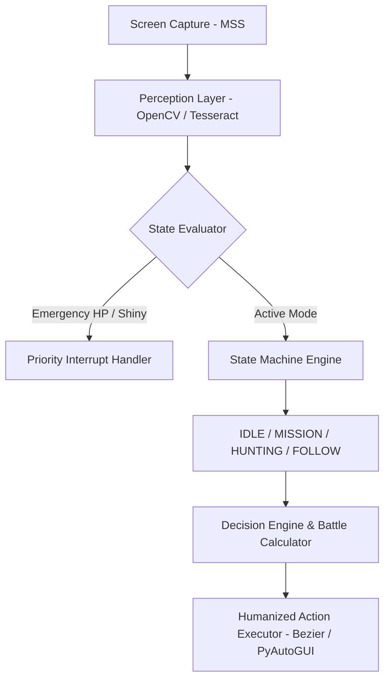

# Autonomous Computer Vision & State Machine Agent 🤖

[](https://www.python.org/)
[](https://opencv.org/)
[](https://github.com/tesseract-ocr/tesseract)
[]()
[](LICENSE)

An autonomous real-time control agent designed for screen perception, Optical Character Recognition (OCR), state-driven decision logic, and humanized automation in Tibianic-like 2D MMORPG environments.

> **Disclaimer:** This project is developed strictly for **educational, research, and non-commercial automation testing purposes**. Use at your own discretion.

---

## 🎯 Overview

Automating interactions within 2D retro MMORPGs presents significant challenges regarding real-time vision processing, dynamic state evaluation, low-latency UI capturing, and non-deterministic input execution.

This software solves these challenges by combining:
1. **Ultra-Fast Visual Perception Layer**: Screen capture via `mss` coupled with `OpenCV` template matching and HSV color analysis.
2. **Contextual Text Extraction**: `Tesseract OCR` engine processing low-contrast UI text (HP bars, player names, combat dialogue).
3. **Finite State Machine Architecture**: Modular operational states (*IDLE*, *MISSION*, *HUNTING*, *FOLLOW*) executing dynamic logic loops.
4. **Anti-Detection & Humanization Subsystem**: Bezier curve movement trajectories, randomized micro-delays, and human action simulation.

---

## ✨ Key Features

### 🖼️ Real-Time Vision & Perception
* **Color Space Analysis (HSV)**: High-frequency color detection (5–10ms latency) for HP bar monitoring and dynamic combat evaluation.
* **Optical Character Recognition**: Tesseract-driven text extraction for target identification, party chat parsing, and combat logs.
* **Shiny & Rare Entity Detection**: Audio and visual alerts triggered immediately upon matching rare entity assets.

### 🧠 State Machine & Tactical Decision Engine
* **Dynamic Battle Logic**: Turn-based damage prediction, type effectiveness calculation (STAB multipliers), speed tier analysis, and item inference (Choice Band, Life Orb, Choice Scarf).
* **Multi-Mode Execution**:
  * **IDLE**: Passive observer for rare entity detection.
  * **MISSION**: Autonomous quest navigation & prompt handling.
  * **HUNTING**: Targeted target selection and selective flee logic.
  * **FOLLOW**: OCR & visual template matching to shadow a primary character account across game zones.

### 🕹️ Real-Time Control & Input Humanization
* **Global Hotkeys System**: Change modes on-the-fly (`F1`–`F9`) with ~1 second switching latency.
* **Low-Latency UDP Remote Control**: Send IPC commands to an agent running inside a minimized Virtual Machine (VM).
* **Humanized Inputs**: Non-linear Bezier curves for cursor path movement and randomized key-press delays (50–500ms).

---

## 🛠 Tech Stack

| Domain | Technology / Library | Description |
| :--- | :--- | :--- |
| **Language** | Python 3.10+ | Core engine and state orchestration |
| **Vision & Image** | OpenCV (`opencv-python`) | Pattern matching, HSV color masks |
| **OCR** | Tesseract OCR (`pytesseract`) | In-game text and UI data extraction |
| **Capture & Control** | `mss`, `pyautogui`, `pynput` | Cross-platform fast screen grab & global keyboard hooks |
| **Mathematics & Motion** | `scipy` | Bezier curve calculations for natural cursor kinematics |
| **Logging & Config** | `loguru`, PyYAML | Execution diagnostics and dynamic configuration |

---

## 🏗 System Architecture & Workflow



---

## 🚀 Getting Started

### Prerequisites

* **Operating System**: Windows 10/11 (Required for native input & alert subsystems).
* **Python**: `3.10` or higher.
* **Tesseract OCR Engine**:
  * Download and install Tesseract OCR from [UB-Mannheim/tesseract/wiki](https://github.com/UB-Mannheim/tesseract/wiki).
  * Ensure the executable path matches your configuration (Default: `C:\Program Files\Tesseract-OCR\tesseract.exe`).

### Installation

1. **Clone the repository**:
   ```bash
   git clone https://github.com/Fesisp/PokeBot.git
   cd PokeBot
   ```

2. **Set up a Virtual Environment**:
   ```bash
   python -m venv venv
   # Windows PowerShell
   .\venv\Scripts\Activate.ps1
   ```

3. **Install Dependencies**:
   ```bash
   pip install -r requirements.txt
   ```

4. **Configuration Verification**:
   Edit `config/settings.yaml` to ensure your Tesseract OCR path and screen coordinates match your target client.

---

## 🎮 Usage

### Launching the Agent

1. Open the target game client and ensure it is unobstructed on screen.
2. Run the main entry point:
   ```bash
   python run_bot.py
   ```

### Hotkey Mapping (Real-Time Control)

| Key | Mode / Action | Description |
| :---: | :--- | :--- |
| `F1` | **IDLE Mode** | Passive screen scanning (alerts on target detection) |
| `F2` | **MISSION Mode** | Autonomous navigation and quest interactions |
| `F3` | **HUNTING Mode** | Targeted entity hunting & selective retreat |
| `F4` | **FOLLOW Mode** | Shadows primary lead character |
| `F5` | **Pause** | Temporarily halts execution |
| `F6` | **Resume** | Resumes agent operations |
| `F9` | **Stop** | Gracefully shuts down agent thread |

---

## 📂 Project Structure

```text
PokeBot/
├── assets/           # Template images for visual matching
├── config/           # System settings & mode configurations (YAML)
├── data/             # Game knowledge bases (Move sets, type matrices)
├── docs/             # Technical guides and architecture details
├── src/
│   ├── action/       # Humanized mouse/keyboard execution engine
│   ├── core/         # Main loop, thread manager, state orchestrator
│   ├── decision/     # Tactical engine, damage predictor & AI inference
│   ├── knowledge/    # Game knowledge managers
│   ├── perception/   # OpenCV vision processing & OCR wrappers
│   └── utils/        # Logger and auxiliary utilities
├── tests/            # Test suite
└── run_bot.py        # Primary application entry point
```

---

## 📄 License

Distributed under the **MIT License**. See `LICENSE` for details.
